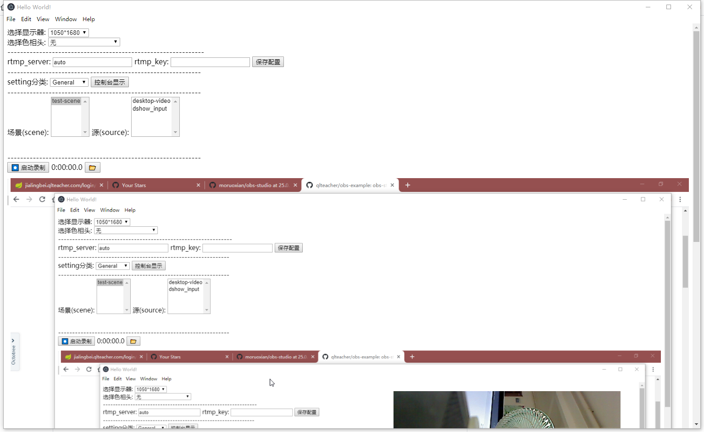

#
只依赖Electron和OBS-node的简单例子

##



## 安装

```
yarn install
```

## 运行

```
yarn start
```

## 如果因为下载obs库安装失败
 2. 那么就修改 `package.json`:

    ```json
    {
        "devDependencies": {
            "obs-studio-node": "file://C:/where/you/cloned/obs-studio-node/build/obs-studio-node-0.3.21-win64.tar.gz"
        }
    }
    ```


## log

log文件在 `osn-data\node-obs\logs`.

## 参考

源obs库
https://obsproject.com/

node封装的obs库(参考/抄了很多这个项目的测试类)
https://github.com/stream-labs/obs-studio-node

vue版本的node_obs(参考/抄了很多这个项目的代码)
https://github.com/stream-labs/streamlabs-obs

## 用法
> **重要:** 使用 Electron 时, 所有显示的内容都必须在主进程中完成, 不能在渲染国产中执行. 否则你会看到异常 `Uncaught Error: Failed to host and connect.`

### 导入 `obs-studio-node`
TypeScript:
```TypeScript or ES2015
import * as osn from "obs-studio-node";
```
JavaScript:
```JavaScript
const osn = require("obs-studio-node");
```

### 初始化
```JavaScript
const { Subject } = require("rxjs");
// 这里可以使用uuid,如同streamlabs-obs里面的那样
osn.NodeObs.IPC.host("obs-studio-node-example");
// 设置工作目录
osn.NodeObs.SetWorkingDirectory(path.join(__dirname, "../../node_modules/obs-studio-node"));
// OBS Studio 配置文件和目录
const obsDataPath = path.join(__dirname, "../../osn-data"); 
// 初始化 api 传入 locale, path 和 version
const initResult = osn.NodeObs.OBS_API_initAPI("en-US", obsDataPath, "1.0.0");
if (initResult !== 0) {
  const errorReasons = {
    "-2": "DirectX could not be found on your system. Please install the latest version of DirectX for your machine here <https://www.microsoft.com/en-us/download/details.aspx?id=35?> and try again.",
    "-5": "Failed to initialize OBS. Your video drivers may be out of date, or Streamlabs OBS may not be supported on your system.",
  };
  const errorMessage = errorReasons[initResult.toString()] || `An unknown error #${initResult} was encountered while initializing OBS.`;
  console.error("OBS init failure", errorMessage);
  // see below for this function
  shutdown();
  throw Error(errorMessage);
}
const signals = new Subject()
osn.NodeObs.OBS_service_connectOutputSignals((signalInfo) => {
    signals.next(signalInfo);
});
```

### 配置 (录像)
```JavaScript
function getAvailableValues(category, subcategory, parameter) {
  const categorySettings = osn.NodeObs.OBS_settings_getSettings(category).data;
  if (!categorySettings) {
      console.warn(`There is no category ${category} in OBS settings`);
      return [];
  }
  const subcategorySettings = categorySettings.find(
      (sub) => sub.nameSubCategory === subcategory,
  );
  if (!subcategorySettings) {
      console.warn(`There is no subcategory ${subcategory} for OBS settings category ${category}`);
      return [];
  }
  const parameterSettings = subcategorySettings.parameters.find(
      (param) => param.name === parameter,
  );
  if (!parameterSettings) {
      console.warn(`There is no parameter ${parameter} for OBS settings category ${category}.${subcategory}`);
      return [];
  }
  return parameterSettings.values.map((value) => Object.values(value)[0]);
}
function setSetting(category, parameter, value) {
  let oldValue;
  // Getting settings container
  const settings = osn.NodeObs.OBS_settings_getSettings(category).data;
  settings.forEach((subCategory) => {
    subCategory.parameters.forEach((param) => {
      if (param.name === parameter) {
        oldValue = param.currentValue;
        param.currentValue = value;
      }
    });
  });
  // Saving updated settings container
  if (value != oldValue) {
    osn.NodeObs.OBS_settings_saveSettings(category, settings);
  }
}
setSetting("Output", "Mode", "Simple");
const availableEncoders = getAvailableValues("Output", "Recording", "RecEncoder");
setSetting("Output", "RecEncoder", availableEncoders.slice(-1)[0] || "x264");
setSetting("Output", "FilePath", path.join(__dirname, "../videos"));
setSetting("Output", "RecFormat", "mkv");
setSetting("Output", "VBitrate", 10000); // 10 Mbps
setSetting("Video", "FPSCommon", 60);
```

### 场景(scene) and 源(source)
#### 创建
大概是这样创建:
```JavaScript
const scene = osn.SceneFactory.create("myScene");
```
然后添加一个源(source)并添加到场景(scene)中
```JavaScript
const source = osn.InputFactory.create("image_source", "logo", { file: path.join(__dirname, "../assets/icons/favicon.png") });
const sceneItem = scene.add(source);
```

`osn.InputFactory.create()` 方法需要参数 `id`, `name` 和 `settings`. 
`id` 只能是有限的几个,具体取值可以参考 obs-studio-node中的/tests/osn-tests/util/obs_enums.EOBSInputTypes
`settings` 对象 根据不同的类型,可设置的值也不同, 如 videos,可以设置`looping: true`,具体取值大概可以参考 obs-studio-node中的/tests/osn-tests/util/input_setting.ts , 但是感觉这里不全(streamlabs-obs代码中应该有完全版吧...).

#### 查找
可以根据name获取 场景(scene)和源(source),使用方法 `[factory].fromName(name)`. 例子:
```JavaScript
const myScene = osn.SceneFactory.fromName("myScene");
```

#### 操作 场景项(scene.items)
您可以修改场景项的属性，例如移动,缩放源或者置顶：
```JavaScript
sceneItem.position = { x: 50, y: 50 };
sceneItem.scale = { x: 0.5, y: 0.7 };
sceneItem.moveTop();
```

#### 将场景设置为输出
```JavaScript
osn.Global.setOutputSource(0, this.scene);
```

### 过度(transition)
从两个场景(scenes)间进行转场, 必须先创建一个transition然后设置成output.
```JavaScript
const transition = osn.TransitionFactory.create(transitionType, "myTransition", {});
transition.set(scene);
osn.Global.setOutputSource(0, transition);
```
可以使用`transition.set(scene)`方法设置场景(scene)，然后过渡到另一个场景，如下所示：
```JavaScript
transition.start(300, scene);
```

### 录像(recording)
#### Start
```JavaScript
function getNextSignalInfo() {
  return new Promise((resolve, reject) => {
    signals.pipe(first()).subscribe(signalInfo => resolve(signalInfo));
    setTimeout(() => reject('Output signal timeout'), 30000);
  });
}
let signalInfo;
console.debug('Starting recording...');
osn.NodeObs.OBS_service_startRecording();
console.debug('Started?');
signalInfo = await getNextSignalInfo();
if (signalInfo.signal === 'Stop') {
  throw Error(signalInfo.error);
}
console.debug('Started signalInfo.type:', signalInfo.type, '(expected: "recording")');
console.debug('Started signalInfo.signal:', signalInfo.signal, '(expected: "start")');
console.debug('Started!');
```

#### Stop
```JavaScript
let signalInfo;
console.debug('Stopping recording...');
osn.NodeObs.OBS_service_stopRecording();
console.debug('Stopped?');
signalInfo = await getNextSignalInfo();
console.debug('On stop signalInfo.type:', signalInfo.type, '(expected: "recording")');
console.debug('On stop signalInfo.signal:', signalInfo.signal, '(expected: "stopping")');
signalInfo = await getNextSignalInfo();
console.debug('After stop signalInfo.type:', signalInfo.type, '(expected: "recording")');
console.debug('After stop signalInfo.signal:', signalInfo.signal, '(expected: "stop")');
console.debug('Stopped!');
```

### 预览(Display)
大概这样创建一个:
```JavaScript
const displayId = "myDisplay";
const displayWidth = 960;
const displayHeight = 540;
const resized = () => {
    const { width, height } = previewWindow.getContentBounds();
    osn.NodeObs.OBS_content_resizeDisplay(displayId, width, height + 20);
    osn.NodeObs.OBS_content_setPaddingSize(displayId, 5);
};
previewWindow = new BrowserWindow({
    width: displayWidth,
    height: displayHeight,
    // if you use this, the window will automatically close
    // when the parent window is closed
    parent: parentWindow,
    useContentSize: true,
});
previewWindow.on("close", () => {
    osn.NodeObs.OBS_content_destroyDisplay(displayId);
    previewWindow = undefined;
});
previewWindow.on("resize", resized);
osn.NodeObs.OBS_content_createSourcePreviewDisplay(
    previewWindow.getNativeWindowHandle(),
    "", // or use camera source Id here
    displayId,
);
osn.NodeObs.OBS_content_setShouldDrawUI(displayId, false);
osn.NodeObs.OBS_content_setPaddingColor(displayId, 255, 255, 255);
resized();
```

必须要一个 `BrowserWindow` 然后obs在它上面绘制. 然后必须监听所有的resize 和 move 事件, 否则就画出边界.

可以设置 padding
```JavaScript
osn.NodeObs.OBS_content_setPaddingSize(displayId, 5);
osn.NodeObs.OBS_content_setPaddingColor(displayId, 255, 255, 255);
```

### Shutting down
```JavaScript
function shutdown() {
  try {
    osn.NodeObs.OBS_service_removeCallback();
    osn.NodeObs.IPC.disconnect();
    this.obsInitialized = false;
  } catch (e) {
    throw Error(`Exception when shutting down OBS process${e}`);
  }
}
```
